# Ablauf- und Balkenplan

## Planungsannahmen

- Ein Sprint dauert standardmäßig zwei Wochen.
- Es wird nur 70-80 % der real verfügbaren Kapazität verplant.
- Der Plan verwendet relative Sprints, bis verfügbare Stunden und ein Startdatum bestätigt sind.
- Ein Release kann mehrere Sprints benötigen; neue Erkenntnisse ändern zuerst Scope oder Prognose, nicht rückwirkend den Status.

## Abhängigkeiten

```mermaid
flowchart LR
  A[v0.1 Project Foundation] --> B[v0.2 Content & Data]
  B --> C[v0.3 Rules Engine]
  C --> D[v0.4 Character Creator]
  D --> E[v0.5 First Local Alpha]
  E --> F[v0.6 Play Session]
  F --> G[v0.7 Integrated Alpha]
  G --> H[v0.8 Beta]
  H --> I[v0.9 Release Candidate]
  I --> J[v1.0 Local Player & DM]
  J --> K[v1.1 Settings & Homebrew]
  J --> L[v1.2 Accounts & Sync]
  L --> M[v1.3 Sharing & Roles]
  M --> N[v1.4 Realtime Beta]
  N --> O[v1.5 Stable Multiplayer]
  J --> P[v2.0 Visual Foundation]
  O --> Q[v2.2 Battle Map]
  P --> Q
  Q --> R[v2.5 Advanced VTT]
  R --> S[v3.0 AI Foundation]
  S --> T[v3.1 Solo AI Alpha]
  T --> U[v3.2 AI Quality]
  U --> V[v3.5 Stable AI-DM]
```

## Relativer Balkenplan bis v1.0

Die Spalten sind Planungsblöcke, keine zugesagten Sprints. Nach Schätzung wird jeder Block in echte Sprints zerlegt.

| Meilenstein | B1 | B2 | B3 | B4 | B5 | B6 | B7 | B8 | B9 |
|---|:---:|:---:|:---:|:---:|:---:|:---:|:---:|:---:|:---:|
| v0.1 Foundation | █ |  |  |  |  |  |  |  |  |
| v0.2 Content & Data |  | █ |  |  |  |  |  |  |  |
| v0.3 Rules Engine |  | █ | █ |  |  |  |  |  |  |
| v0.4 Character Creator |  |  | █ | █ |  |  |  |  |  |
| v0.5 Local Alpha |  |  |  | █ | █ |  |  |  |  |
| v0.6 Play Session |  |  |  |  | █ | █ |  |  |  |
| v0.7 Integrated Alpha |  |  |  |  |  | █ | █ |  |  |
| v0.8 Beta |  |  |  |  |  |  | █ | █ |  |
| v0.9 RC / v1.0 |  |  |  |  |  |  |  | █ | █ |

Die Balken bilden Reife, nicht einen dauerhaft reduzierten Funktionsumfang ab: v0.6 beweist einen kleinen säulenübergreifenden Sitzungsablauf, v0.7 integriert mehrere Sitzungen, v0.8 enthält den vollständigen v1-P0-Umfang, v0.9 stabilisiert und v1.0 nimmt normalen lokalen Kampagnenbetrieb ab. Eine Capability, die im bestätigten v1-Scope liegt, darf nicht allein wegen des kleinen v0.6-Alpha-Slices entfallen.

## Sprint-Zeremonien

| Zeitpunkt | Termin | Zweck |
|---|---|---|
| vor Sprint | Refinement | Stories schneiden, Kriterien und Schätzung klären |
| Sprintbeginn | Planning | Ziel und realistischen Sprint Backlog festlegen |
| laufend | kurzer Check-in | Fortschritt, Blocker und Scope sichtbar machen |
| Sprintende | Review | Ergebnis gegen Akzeptanzkriterien demonstrieren |
| nach Review | Retrospektive | Arbeitsweise verbessern, maximal 1-2 Maßnahmen |
