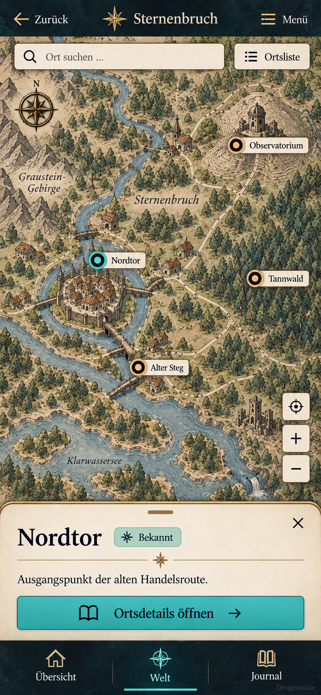
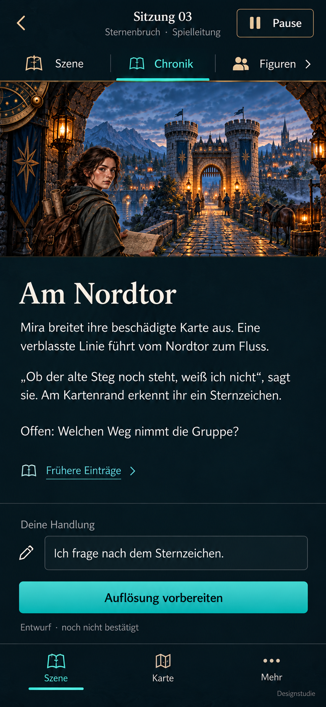

# Mobile Karte und Sitzung – erste Bildstudien

**Status:** neue statische Entwürfe zur Durchsicht, nicht vom Nutzer abgenommen, keine App-Implementierung. Ergänzung zur [Designreferenz](2026-09-08-visual-direction-and-interaction.md).

## Karte

Die freie Karte bleibt der Hauptinhalt. Auswahl öffnet ein kompaktes Ortsblatt mit sichtbarer Schließen-Aktion; der ausgewählte Marker bleibt oberhalb sichtbar. „Ortsdetails öffnen“ führt zur ausführlichen Ansicht. Suche und Ortsliste bieten Alternativen zum Verschieben und Treffen von Markern. Zoom und Zurücksetzen bleiben außerhalb des Ortsblatts.

**Noch nachschärfen:** Bei 390 CSS-Pixeln ist die Kopfzeile mit Zurück, Kampagnentitel und Menü eng. Lange Kampagnentitel müssen begrenzt dargestellt werden, ohne die Bedienziele zu verdrängen. Das Zielkreuz für Zurücksetzen braucht eine eindeutige zugängliche Beschriftung; es ist keine GPS-Ortung. Geografie und Beschriftungen sind illustrative Referenzen, keine gemeinsamen kalibrierten Kartendaten.

## Sitzung im Lesefokus

Einspaltige Szene und Chronik statt verkleinerter Desktop-Doppelspalte. Figurenkontext wird über „Figuren“ separat geöffnet. Die Rückkehr muss Leseposition und Handlungsentwurf erhalten. Eine vorbereitete Auflösung ist noch kein bestätigtes Spielergebnis.

**Noch nachschärfen:** „Szene“ erscheint oben als Darstellungswahl und unten als Bereichsname; das ist mehrdeutig. Für einen Prototyp unten „Sitzung“ verwenden und oben klar zwischen Szenen- und Lesefokus unterscheiden. Die Illustration ist im generierten Lesefokus noch relativ hoch; ein einklappbarer Bildbereich sollte mehr Platz für längere Texte schaffen.

Bei geöffneter Bildschirmtastatur darf die Szene weichen. Eingabe und primäre Aktion müssen oberhalb der Tastatur erreichbar bleiben; die untere Bereichsnavigation kann während der Eingabe entfallen. Dieses Verhalten ist im Bild nicht dargestellt oder getestet. Das gesamte statische Layout passt nicht automatisch bei größerer Schrift in einen Bildschirm: natürlicher Inhaltsfluss und kontrollierter Scrollbereich sind zu prüfen, nicht Schriftverkleinerung.

## Gemeinsame nächste Prüfung

- Tatsächliche 320-/390-CSS-Pixel-Ansicht, lange deutsche Labels und 200 % Zoom.
- Touchziele, Kontrast, Safe Areas und sichtbare Schließen-/Zurück-Aktionen.
- Ortsblatt erweitern/schließen ohne verlorene Auswahl; Kartengesten nicht mit Blattgesten verwechseln.
- Kontext öffnen/schließen bei vorhandenem Entwurf und zurückgescrollter Chronik.
- Bildschirmtastatur, Geräteausrichtung und Reduced Motion.

Die Bilder sind Layout- und Stilreferenzen, kein Nachweis dieser Eigenschaften. Mobile Navigation bleibt vorläufig und benötigt ein gemeinsames Review mit der Desktop-History-Politik.

## Herkunft

Erzeugt mit dem integrierten Imagegen-Werkzeug; beide Original-PNGs unverändert ins Projekt kopiert. Keine neuen Produktionsassets oder Laufzeitbudgets freigegeben.

- `06-mobile-map.png`: Generierung `exec-7a1f0eaf-c21f-4713-9cdb-d5fba7a16752`, Referenz `03-world-map.png`. Auftragskern: eigenständige mobile freie Karte mit Suche, Zoom und kompaktem schließbarem Ortsblatt, keine Desktop-Seitenleiste.
- `07-mobile-session.png`: Generierung `exec-8ae0f188-5b85-448b-b3e6-a7778666244d`, Referenz `05-session-reading-panel.png`. Auftragskern: einspaltige mobile Sitzung mit kleinerer Szene, lesbarer Chronik, separatem Figurenkontext und Handlungseingabe.

Die vollständigen Generierungsprompts stehen in den Toolaufrufen des Projektgesprächs; diese Angaben sind Zusammenfassungen.
