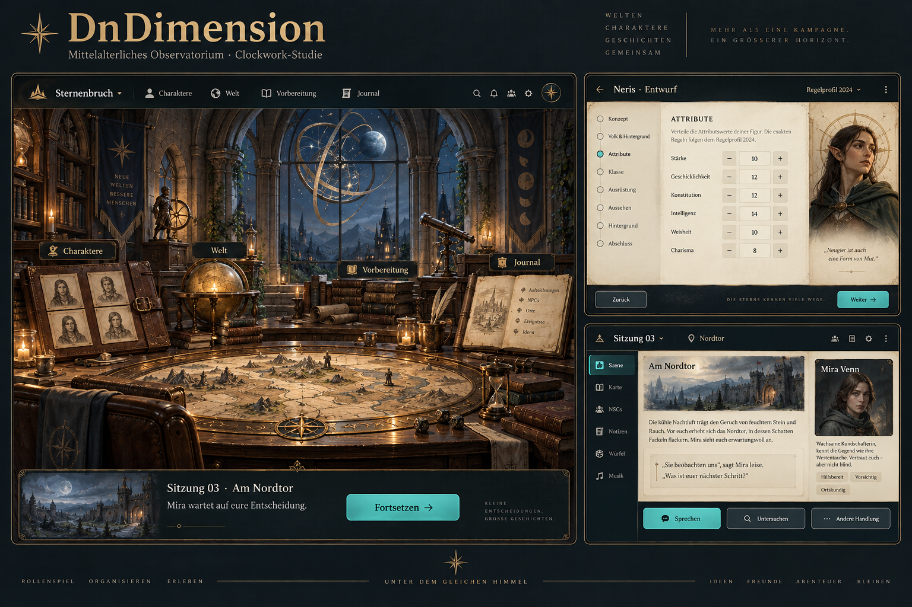
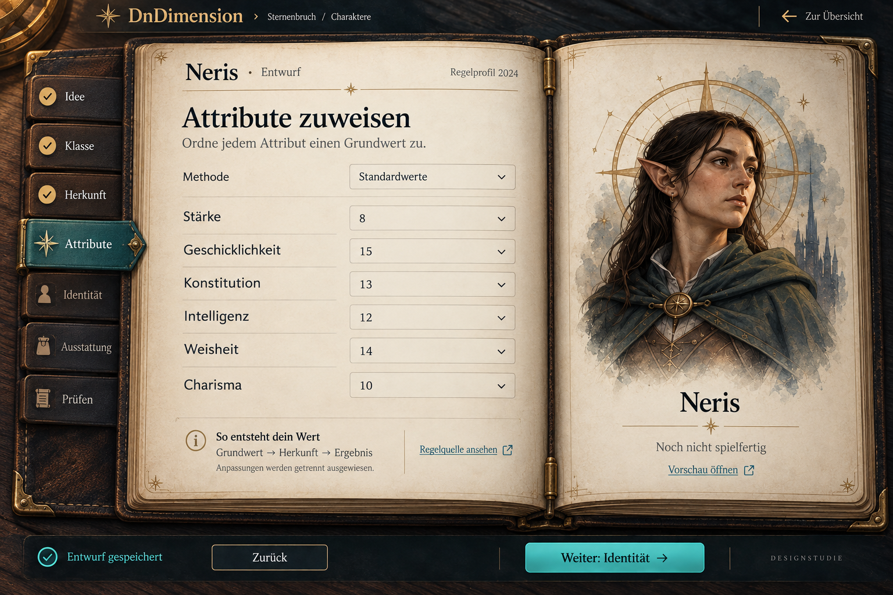
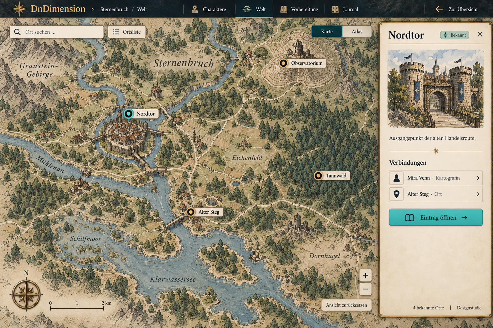
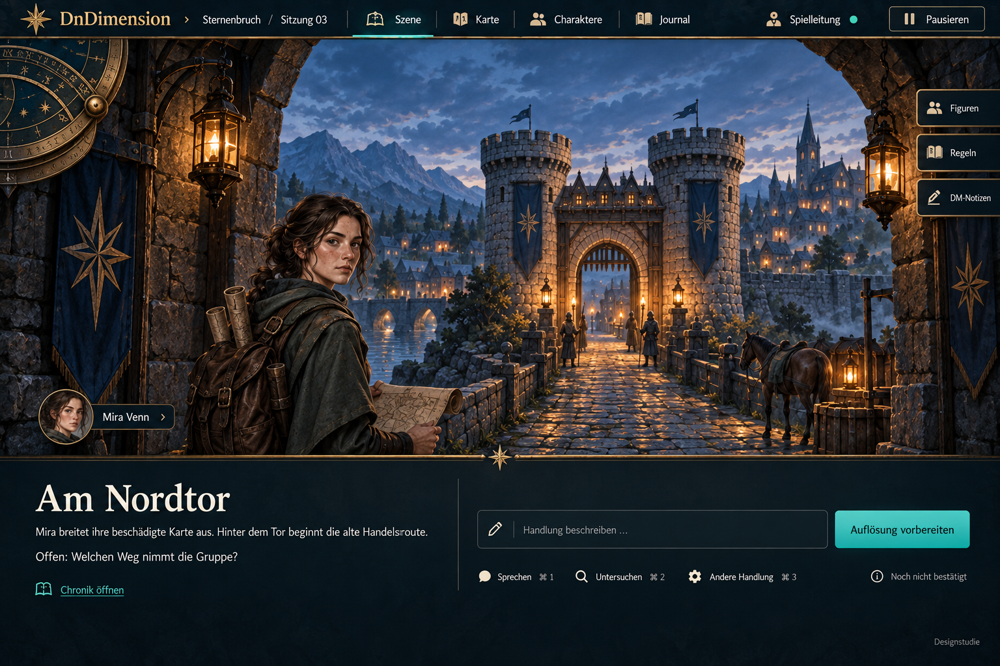
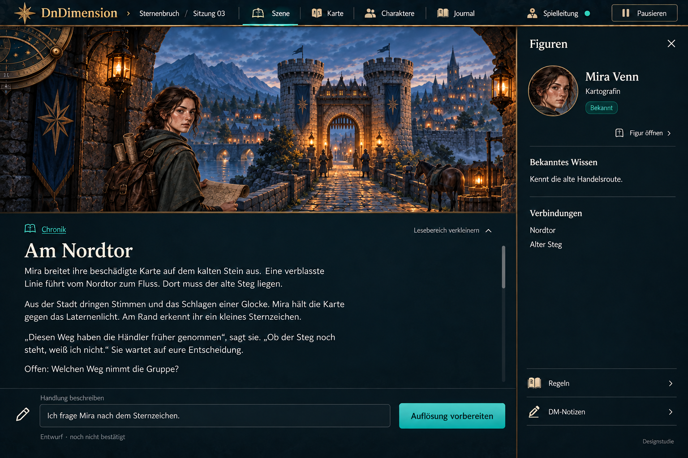

# DnDimension – bevorzugte Designrichtung und Bedienkonzept

**Stand:** 2026-09-08. **Status:** visuelle Richtung im Gespräch positiv bestätigt; Interaktionsdetails sind Vorschläge, noch nicht implementiert oder durch Nutzertests bestätigt. Keine Änderung der akzeptierten Release-Gates.

Diese Referenz ergänzt das [Erlebniskonzept](../superpowers/specs/2026-09-08-immersive-experience-design.md), das [Storyboard](../superpowers/specs/2026-09-08-campaign-room-storyboard.md) und den [Ausbauplan](../delivery/2026-09-08-experience-plan.md). Bei visuellen Abweichungen dokumentiert sie das neuere Nutzerfeedback; für fachliche Regeln und Releaseumfang bleiben die bestehenden Decisions maßgeblich.

## 1. Die gestalterische Leitlinie

**Die Welt trägt das Erlebnis, die Oberfläche unterstützt es.** Mittelalterliche Handwerkskunst, räumliche Tiefe und zurückhaltende astronomische Mechanik geben DnDimension Identität. Dunkles Holz, Leder, Papierlagen und Messing werden gezielt eingesetzt; nicht jeder Bildschirm ist ein Buch und nicht jedes Werkzeug benötigt einen Rahmen.

Der Nutzer bevorzugt großzügige Szenen und aufgabenbezogene Arbeitsflächen gegenüber überfüllten, generisch wirkenden Dashboard-Karten. Räumlichkeit entsteht zunächst durch Perspektive, Licht und Materialstaffelung. Die Bilder belegen weder echtes 3D noch Animation oder Bedienbarkeit.

## 2. Gesicherte visuelle Referenzen

### Kampagnenraum

Sehr positiv aufgenommen: Licht, Raum, Stationen und mittelalterliches Clockwork. **Nur der große Raumteil ist die bevorzugte aktuelle Referenz.** Die beiden kleinen Arbeitsansichten auf dieser Tafel sind frühe Entwürfe und werden durch die folgenden Bilder ersetzt. Illustrative Slogans, Symbole und Werte sind keine Anforderungen.

### Figurenbuch

Bevorzugt gegenüber dem flachen Erstentwurf: echter Foliantencharakter mit Falz, Papierlagen, Lederregistern und feinen Scharnieren. Formulare bleiben scharf, gerade und ruhig. Zahlen sind illustrative Grundwertzuordnungen, keine validierte vollständige Figur. Die endgültige UI verwendet die festgelegten Foundation-Schriften; generierte Schriftformen sind nicht verbindlich.

### Weltkarte

Ausdrücklich gegenüber der Buch-/Atlasvariante bevorzugt: große freie Kartenfläche, Suche, Zoom und ein schließbares Ortsdossier. Der Atlas bleibt eine optionale Darstellungsvariante, keine Voraussetzung der Kartennavigation. Diese Illustration enthält noch perspektivische Kartensymbole; Geometrie, Entfernungen und Maßstab sind nicht vermessen. Generierte zusätzliche Ortsnamen etablieren keine verbindlichen Kampagnenfakten.

### Aktive Sitzung – Szene im Vordergrund

Bevorzugt gegenüber der hellen, kartenreichen Verwaltungsansicht: große Szene mit Tiefe, dunkle ruhige Lesefläche und Werkzeuge am Rand. Figuren, Regeln und DM-Notizen sind bedarfsweise zugänglich. Die im Bild generierten Tastenkürzel sind nicht spezifiziert und werden nicht übernommen.

### Aktive Sitzung – mehr Text und Figurenkontext

Positiv aufgenommen: kleinere, weiterhin präsente Szene; mehr Chronikfläche; schließbares Figurenpanel; unten erreichbare Handlungseingabe. Dies ist ein Zustand derselben Sessionansicht, kein eigener Spielmodus. Der Beispieltext ist eigene synthetische Erzählung; gespeicherte Spielzustände existieren dadurch nicht.

## 3. Navigation ohne Umwege

| Bereich | Primärer Weg | Zurück und Kontext |
|---|---|---|
| Kampagnenraum | Station oder gleichwertiger beschrifteter Direktlink | letzter Kampagnenkontext; keine erneute Intro-Tour |
| Figurenbuch | Kapitelregister und Weiter/Zurück | Entwurf und aktive Kapitelwahl bewahren; ungültig ist nicht gleich ungespeichert |
| Welt | Karte, Suche oder Ortsliste wählen denselben Ort | Kartenausschnitt bleibt beim Schließen des Dossiers erhalten |
| Sitzung | Szene, Karte, Charaktere und Journal direkt erreichbar | Sessionidentität und Handlungsvorschlag bleiben erhalten |
| Kontextpanel | beschrifteter Auslöser öffnet Figur, Regeln oder DM-Notizen | Schließen zurück zum Auslöser; keine verschachtelten Panelstapel |

Routenwechsel und temporäre Panels werden unterschieden: Browser-Zurück führt zwischen Hauptansichten zurück; ein rein ergänzendes Panel erzeugt zunächst keinen zusätzlichen History-Eintrag. Sein Schließen erfolgt per sichtbarer Schließen-Aktion oder Escape. Direktlinks auf Einträge öffnen eine eigenständig verständliche Detailansicht. Diese genaue History-Politik ist vor dem Prototyp abzustimmen, nicht aus den Bildern abzuleiten.

Ein Wechsel zwischen Arbeitsansichten führt nicht zwangsläufig über den Raum. Pro Kontext ist höchstens ein ergänzendes Werkzeugpanel offen. Der Wechsel von Figur zu Regel ersetzt dessen Inhalt, erhält aber den Lesezustand der Sitzung. Unsichere, noch nicht gespeicherte Änderungen verlangen eine bewusste Entscheidung; eine Animation darf diesen Schutz nicht umgehen.

## 4. Bedienvertrag der Karte

- Verschieben per Ziehen auf freier Kartenfläche; kleine Pointerbewegungen auf Markern zählen nicht sofort als Drag. Markerwahl öffnet das Dossier, nicht automatisch eine Reise oder neue Szene.
- Zoomen über Plus/Minus, unterstützte Touch-Gesten und gezielt im Kartenbereich ausgelöste Radeingaben. Außerhalb der Karte bleibt normales Seitenscrollen erhalten. Zoom orientiert sich am Zeiger beziehungsweise Gestenzentrum.
- Tastatur erreicht Suche, Ortsliste und Marker. Zusätzlich sind beschriftete Verschiebesteuerungen über die Kartenwerkzeuge erreichbar, damit Drag nicht zwingend nötig ist. Pfeiltasten verschieben nur bei bewusst fokussiertem Kartenbereich, nicht beim Schreiben in Sucheingaben.
- Markerlabels bleiben lesbar; bei Überlagerung werden bekannte Orte gruppiert oder über die Liste angeboten. Verborgene Orte beeinflussen weder sichtbare Gruppenzähler noch Suchvorschläge.
- Öffnen des Dossiers verdeckt den ausgewählten Ort nicht. Wenn eine begrenzte Verschiebung nötig ist, wird nur der erforderliche Abstand korrigiert; kein automatischer Zoomsprung. Schließen setzt nicht die gesamte Karte zurück.
- „Ansicht zurücksetzen“ stellt einen definierten Überblick über die freigegebene Karte her. Auswahl, Zoom und Ausschnitt bleiben ansonsten beim Bereichswechsel erhalten.
- Karte und Atlas verwenden dieselben Orts-IDs. Ein ausgewählter Ort bleibt beim Darstellungswechsel ausgewählt; wenn die Illustrationen keine gemeinsame Koordinatenabbildung besitzen, wird im Zielmedium dieser Ort fokussiert statt identische Pixelpositionen vorzutäuschen.
- Maßstab und Entfernungsangaben erscheinen erst bei hinterlegter Kalibrierung. Diese regionale Übersicht ist kein taktisches VTT: kein automatisches Pathfinding, keine Sichtlinien oder Bewegungsreichweiten durch diesen Entwurf zugesagt.

## 5. Lesen, Nachschlagen und Handeln in der Sitzung

Der Nutzer steuert die Aufteilung: kompakte Chronik für Szenenfokus oder erweiterter Lesebereich. Zusätzlicher Text erzwingt keinen automatischen Layoutwechsel. Die Szene darf kleiner werden; Schrift wird nicht verkleinert, um alles in dieselbe Fläche zu pressen.

Die Chronik bewahrt ihre Leseposition beim Öffnen von Kontext. Neue Ereignisse reißen eine zurücklesende Person nicht ans Ende; ein Hinweis „Neue Einträge“ führt auf Wunsch dorthin. Nur wenn bereits das Ende verfolgt wird, darf die Ansicht mitlaufen. Der Handlungsvorschlag liegt außerhalb des Chronik-Scrollbereichs und bleibt erhalten.

„Auflösung vorbereiten“ führt zunächst zur menschlichen Prüfung von Absicht, Ziel und nötiger Auflösung. Es bestätigt weder eine erfolgreiche Handlung noch Ressourcenänderungen. Rückkehr aus dieser Prüfung bewahrt den Vorschlag. Bilder, Erzählung und Zustand dürfen keinen bestätigten Effekt vortäuschen.

DM-Notizen sind ausschließlich im passenden Wissenskontext zugänglich. Eine Spielerprojektion lädt keine verborgenen Panelinhalte oder Übergangsbilder. Der sichtbare Begriff „Spielleitung“ beschreibt den Kontext der Studie, kein bereits vorhandenes Account-/Rechtesystem.

## 6. Bewegung und räumliche Tiefe

Es gelten die [vorhandenen Bewegungsbudgets und Qualitätskriterien](../superpowers/specs/2026-09-08-immersive-experience-design.md). Präzisierung für diese Bilder:

- Raum → Station: eine kurze kontrollierte Annäherung; passende Buchschließe oder Kompassmechanik innerhalb desselben Zeitbudgets, nicht als zusätzliche Wartephase.
- Kontextpanel: 180–240 ms ruhiges Einblenden/Versetzen; keine neue Kamerafahrt und keine federnde Schublade. Die zentrale Szene bleibt als Orientierung erkennbar.
- Chronikgröße: nutzergesteuerter Wechsel, stabiler Leseanker. Nicht gleichzeitig Kamera, Text und Panel unabhängig animieren.
- Karte: direkte Rückmeldung beim Verschieben und Zoomen; kein obligatorisches filmisches Anfliegen jedes Markers.
- Clockwork: wenige funktional zugeordnete Mechanismen. Im Ruhezustand keine dauerrotierenden Zahnräder. Kein Kamerawackeln oder Parallax hinter längerem Lesetext.
- Reduced Motion: Zustandswechsel ohne räumliche Bewegung, mit denselben Inhalten, Zielen und Fokusregeln. Kein optionales Asset blockiert die funktionale Oberfläche.

## 7. Mobile Anordnung als eigener Entwurf

Die Desktopbilder werden nicht einfach verkleinert. Folgende mobile Regeln sind vorgeschlagen, noch nicht visualisiert oder getestet:

| Ansicht | Mobile Priorität | Kontext und Rückkehr |
|---|---|---|
| Raum | Fortsetzen und beschriftete Stationen vor dekorativer Raumtiefe | statische Illustration; keine notwendige Kameratour |
| Figurenbuch | ein Kapitel pro Arbeitsfläche, Kapitelwahl als Liste | Porträt/Vorschau einklappbar; kein breiter Doppelbogen |
| Karte | größtmögliche Kartenfläche mit Suche und Ortsliste | schließbares unteres Ortsblatt; erweiterte Details bei Bedarf, ausgewählter Marker bleibt erreichbar |
| Sitzung | wählbarer Szenen-/Lesefokus, normale lesbare Schrift | Figurenpanel als eigene temporäre Ansicht; Rückkehr stellt Chronikposition und Entwurf wieder her |

Auf kleinen Geräten ist gleichzeitiges Lesen, Vollbildszene und volles Figurenpanel kein Ziel. Offene Tastatur darf Eingabe und Hauptaktion nicht verdecken; Szenendekoration darf dafür weichen. Temporäre modale Ansichten führen Fokus kontrolliert hinein und beim Schließen zurück. Schließen/Abbrechen bleibt sichtbar, Gesten sind Zusatzwege. Prüfung bei 320 CSS-Pixeln Breite und 200 % Zoom bleibt erforderlich.

## 8. Nächster Nachweis, noch offen

1. Die genaue History- und Panelpolitik im Layoutreview bestätigen.
2. Mobile Karten- und Sessionansicht als statische Studien prüfen.
3. Danach einen ausdrücklich als Demo gekennzeichneten Navigationsprototyp mit synthetischen Daten separat freigeben.
4. Im Prototyp prüfen: Stationswechsel, Tastatur, Reduced Motion, Kartenzoom/Drag, Auswahl unter dem Panel, Browser-Zurück, Leseposition bei neuen Einträgen, Entwurfserhalt, Bildschirmtastatur und Sichtbarkeitsgrenzen.

Erfolg heißt nicht nur „sieht ähnlich aus“: dieselbe Aufgabe muss ohne versteckte Navigation, verlorene Eingaben oder unfreiwillige Bewegung gelingen. Performance, Kontrast und Speicherverhalten sind an diesen Rasterbildern nicht nachgewiesen.

## 9. Herkunft und Assetgrenzen

Die fünf PNGs sind unveränderte, mit dem integrierten Imagegen-Werkzeug im Gespräch erzeugte Designstudien, nun in diesem Repository gesichert. Keine Buchillustrationen wurden als Bildreferenzen verwendet. Die Dateien sind Referenzen für Gestaltung, keine zugesagten Produktionsassets; ihr Gesamtumfang von rund 13 MiB ist kein akzeptiertes Laufzeitbudget. Vor Produktnutzung sind Herkunft, Nutzungsbedingungen, Optimierung und Trennung von Bild und echten UI-Elementen zu prüfen.

| Datei | Originale Generierungskennung | Inhalt des Generierungsauftrags |
|---|---|---|
| 01-observatory-concept.png | exec-b59a6df9-a7aa-4afb-8e74-a1e84734a733 | mittelalterliches Observatorium mit subtiler Mechanik und drei UI-Studien |
| 02-character-folio.png | exec-71cb9dfe-1592-44e5-9d44-6eaa54836918 | Figurenformular zum offenen Folianten mit Registern, Papierlagen und klarer Bedienfläche verfeinern |
| 03-world-map.png | exec-6d58d52b-f8ef-4854-9536-213bdc20b1a9 | Atlasrahmen entfernen, freie Kartenfläche, Ortsdossier, Suche und Zoom darstellen |
| 04-session-immersive.png | exec-7d8852a2-c9de-4a08-ae58-50a665b516ed | Dashboard durch große räumliche Szene, ruhige Chronik und kompakte Handlungseingabe ersetzen |
| 05-session-reading-panel.png | exec-c01333ff-54d8-4cf0-a10c-00062633511e | dieselbe Sitzung mit längerer Chronik und geöffnetem Figurenpanel darstellen |

Dies sind Auftragszusammenfassungen, keine wortgetreuen Promptkopien. Die vollständigen Prompts stehen in den zugehörigen Toolaufrufen des Projektgesprächs. Verworfene Zwischenbilder wurden nicht als aktuelle Referenz in das Repository übernommen; ihre Originale bleiben unverändert am Generierungsort.
