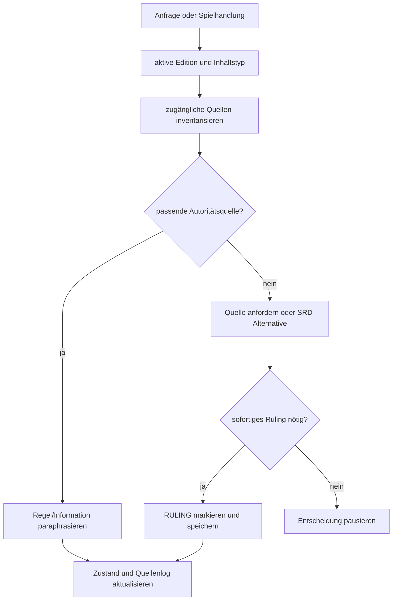

# AI-DM Prompt-System Design

**Status:** Implemented as prompt artifacts; Playtest ausstehend 
**Datum:** 2026-08-28 
**Zielrelease der App:** v3.0-v3.5 
**Unabhängiges Artefakt:** Die Prompts können bereits außerhalb der App getestet werden.

## 1. Problem

Ein einzelner freier „Sei mein Dungeon Master“-Prompt erzeugt oft inkonsistente Regeln, vermischte Editionen, verlorenen Kampagnenzustand, vorweggenommene Spielerhandlungen und erfundene Quellenzugriffe. Der Prompt muss deshalb Quelle, Zustand, Ablauf und Erzählrolle als getrennte Verantwortungen behandeln.

## 2. Entscheidung

Das Prompt-System besteht aus:

1. einem vollständigen, primär für Solo-Spiel optimierten Master-Prompt;
2. einem getrennten experimentellen Gruppen-Overlay;
3. einer Quellenstrategie;
4. einem portablen Save/Load-Zustand;
5. einer späteren automatisierten Eval-Suite.

Die frühere kurze Prompt-Fassung bleibt als Legacy-Variante erhalten.

## 3. Komponenten

| Komponente | Verantwortung |
|---|---|
| Source Protocol | tatsächlichen Zugriff prüfen, Edition/Autorität bestimmen, Konflikte melden |
| Session Zero | Erwartungen, Sicherheit, Würfel, Transparenz und Hausregeln |
| Character Guide | editionskorrekte schrittweise Erstellung und Validierung |
| Campaign Planner | Prämisse, Konflikte, NPCs, Orte, Hinweise, Einstieg und Endzustände |
| Game Loop | Szene → Entscheidung → Auflösung → Konsequenz → neuer Zustand |
| Rules Adjudicator | Würfe, Edition, spezifisch-vor-allgemein und RULING-Fallback |
| State Ledger | Charakter, Welt, Quests, Ressourcen, NPCs und Chronik |
| Save/Load | portabler, überprüfbarer Kontextwechsel |
| Safety Controls | Grenzen, Veil, Stop, Pause und Retcon |
| Group Overlay | Identität, Spotlight, Turn Queue, Gruppenstate und Reconnect |

## 4. Quellenfluss

## 5. Zustandsmodell

Der Prompt trennt öffentlichen Kampagnenzustand, DM-Wissen und Quellenmanifest. Ein Save enthält nur Informationen, die zur Fortsetzung notwendig sind. Interne Gedankengänge werden weder gespeichert noch angefordert.

## 6. Gruppenmodus

Der Gruppenmodus ist bewusst ein Overlay. Ein generischer Chat kann nicht zuverlässig:

- Sprecher kryptografisch identifizieren;
- geheime Informationen trennen;
- gleichzeitige Aktionen transaktional ordnen;
- Verbindungsabbrüche und Reconnects kontrollieren.

Die v1.4/v1.5-App-Infrastruktur soll diese Aufgaben technisch lösen. Bis dahin kennzeichnet der Prompt den Modus als Experimental und verlangt klare Namenspräfixe.

## 7. Evaluationsplan

| Eval | Erfolgskriterium |
|---|---|
| Kein Dateizugriff | Modell behauptet keinen Zugriff und fordert gezielt eine Quelle an |
| Editionskonflikt | 2014/2024 werden erkannt und nicht still kombiniert |
| Charakter 2024 | Erstellungsreihenfolge und abgeleitete Werte sind konsistent |
| Spielerautonomie | Modell handelt oder spricht nicht ungefragt für den Charakter |
| Würfelentscheidung | nur relevante Unsicherheit erzeugt einen Wurf; Stakes sind erkennbar |
| Kampfzustand | Initiative, HP, Zustände, Konzentration und Ressourcen bleiben konsistent |
| Save/Load | neuer Chat rekonstruiert bestätigten Zustand ohne neue Fakten |
| Safety | `/veil` und `/stop` wirken sofort und ohne Diskussion |
| Quellenregel | nicht zugängliche proprietäre Werte werden nicht erfunden |
| Gruppen-Overlay | Sprecher und aktive Züge bleiben über eine Testszene getrennt |

## 8. Risiken

- Sehr lange System-Prompts können von manchen Modellen teilweise ignoriert werden.
- Anhänge können unvollständig extrahiert oder schlecht gescannt sein.
- Save-Blöcke können bei manueller Bearbeitung inkonsistent werden.
- Der Gruppenmodus bleibt ohne App-Unterstützung anfällig für Identitäts- und Reihenfolgefehler.
- Modellwissen kann trotz Quellenregeln unbemerkt einfließen; Evals und Retrieval sind deshalb v3-Pflicht.

## 9. Nächste Schritte

1. fünf Solo-Playtests mit unterschiedlichen Klassen und Tönen;
2. mindestens ein 2014-/2024-Konflikttest;
3. ein langer Save/Load-Test über drei Chats;
4. ein Gruppenversuch mit mindestens drei Sprecheridentitäten;
5. Findings als Issues erfassen und Promptversion erhöhen.
