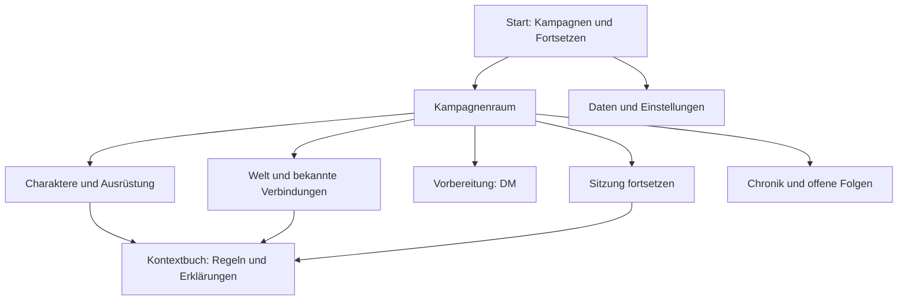

# DnDimension – Der lebendige Kampagnenraum

**Stand:** 2026-09-08 · **Status:** ausgearbeiteter Designvorschlag, noch kein implementierter oder abgenommener Produktumfang

**Auftrag:** Bestehende Planung vertiefen; eine eigenständige, zeitgemäße D&D-Anwendung mit räumlicher Navigation, atmosphärischer Gestaltung und sinnvoller Animation entwerfen.

**Grundlagen:** [Arcane Cartographer](2026-08-29-ui-design-system-foundation-design.md), [Requirements](../../product/requirements-catalog.md), [Recherche und Reviewgrenzen](../../research/2026-09-08-experience-review.md), [Ausbau- und Prüfplan](../../delivery/2026-09-08-experience-plan.md).

## 1. Produktversprechen

DnDimension soll sich wie der eigene Ort für Abenteuer anfühlen: Man kehrt in eine Kampagne zurück, versteht die aktuelle Situation und kann unmittelbar weiterspielen. Regeln, Charakter, Welt und Chronik sind miteinander verbunden. Die App vermittelt Neulingen im jeweiligen Moment, was sie tun können und welche Folgen eine Entscheidung hat.

Die räumliche Oberfläche stellt reale Aufgaben dar: ein Buch für die Figur, ein Kartentisch für die Welt, ein Spielleiterschirm für Vorbereitung und ein Journal für gespielte Ereignisse. Beschriftungen wie „Charaktere“ bleiben sichtbar; niemand muss die Metapher erraten.

Das langfristige Ziel umfasst die bereits gewünschten Modi: menschlicher DM, Solo mit KI-DM, Gruppe mit KI-DM sowie eigene Verwaltung mehrerer Figuren. Die akzeptierte v1-Baseline bleibt zunächst lokal und menschlich geleitet. Ein schöner Kampagnenraum allein ist noch kein autonom spielbares Solo-Abenteuer.

## 2. Drei Gestaltungsansätze

| Ansatz | Erlebnis | Aufwand und Grenzen | Bewertung |
|---|---|---|---|
| **Räumlicher Hybrid** | atmosphärischer Raum, kurze Kamerafahrten, klare Arbeitsflächen | eigene Szenenassets und Übergänge; zwei Darstellungen derselben Navigation prüfen | Empfehlung |
| Vollständig begehbare 3D-Welt | freie Bewegung durch eine Gilde oder einen Turm | Navigation, Kamera, Kollisionen, Assetproduktion und mobile Bedienung werden ein eigenes Spielprojekt | mögliche spätere Spielerei, kein notwendiger Zugang zu Werkzeugen |
| Illustrierter 2D-Atlas | hochwertige Bilder, Ebenentiefe, direkte Navigation | weniger räumliche Präsenz, dafür leicht und gut auf allen Geräten | erste realistische Präsentationsstufe und dauerhafte Alternative |

Der Hybrid wächst aus dem 2D-Atlas. Die Wirkung des Raums wird zuerst mit festen Ansichten und einem kurzen Storyboard geprüft; echtes 3D folgt nur, wenn die räumliche Kontinuität den Mehraufwand rechtfertigt.

## 3. Art Direction: Arcane Observatory

Arbeitsname des Raums: **Observatorium der Geschichten**. Die bisher freigegebene Arcane-Cartographer-Identität bleibt die Basis. Das Observatorium erweitert sie um Architektur, Licht und räumliche Orientierung.

- Dunkler blaugrauer Stein und gefärbtes Kartenpapier tragen die großen Flächen.
- Messing markiert ausgewählte Kapitel, Instrumente und wichtige Verbindungen.
- Warmes Licht fällt auf den Spieltisch; kühles Sternenlicht gibt dem Raum Tiefe.
- Türkis bleibt das Signal für bedienbare Hauptaktionen und aktive Wegmarken.
- Ein abstrahiertes Wegfinder-Sigil verbindet Charakterentscheidung, Weltfund und Journaleintrag.
- Illustrationen bekommen größere, zusammenhängende Flächen; Fließtext liegt auf ruhigem Untergrund.

Die vorhandenen semantischen Farben und die Schriftrollen von Alegreya Sans SC und Atkinson Hyperlegible Next werden zunächst weiterverwendet. Dekorative Schrift bleibt auf kurze Titel begrenzt. Werte, Formulare und Regeltexte verwenden die gut lesbare UI-Schrift.

Die genaue Raumstimmung ist eine Annahme des Entwurfs. Eine warme Gilde oder ein düsterer Turm können dieselbe Informationsarchitektur nutzen. Thematische Unterschiede dürfen Navigation, Fokus und Statusbedeutung nicht verändern.

### Stilpräzisierung: mittelalterliches Clockwork

Nutzerfeedback vom 2026-09-08: mittelalterlicher Flair und etwas Clockwork, bei sauberer, flüssiger und hochwertiger Navigation. Diese Richtung konkretisiert das Observatorium; sie ist keine Freigabe zur Produktimplementierung.

Leitmotiv: **die Werkstatt eines arkanen Kartografen in einem mittelalterlichen Observatorium**. Handwerkliche Materialien bilden die Basis, präzise Instrumentenmechanik setzt Akzente. Kein industrieller Steampunk mit Rohrleitungen und Dampfmaschinen; keine futuristischen Hologramme oder dominanten Neonflächen. Dies ist Fantasy-Art-Direction, kein Anspruch historischer Rekonstruktion.

- Architektur: steinerne Bögen, dunkle Holzflächen, geschmiedete Halterungen und warmes, ruhiges Licht.
- Arbeitsobjekte: ledergebundene Bücher, helle Pergamentflächen, graviertes Messing, Astrolabien und feine Teilungsmarken.
- Clockwork: plausible Gelenke, Buchschließen und konzentrische Instrumentenringe. Zahnräder nur an erkennbaren Mechanismen, nicht an jedem Button.
- Oberfläche: wenige feine Rahmen und klare Abstände. Texturen bleiben schwach und außerhalb dichter Tabellen oder Fließtexte; Gebrauchsspuren dürfen nicht wie deaktivierte Bedienelemente aussehen.
- Typografie und semantische Farben bleiben aus der Foundation erhalten. Keine Frakturschrift für Navigation, Regeln oder Werte; Türkis bleibt ein sparsamer Aktionsakzent ohne flächiges Leuchten.

### Stationen als zusammenhängendes Ensemble

| Station | Eigenes Motiv | Übergang zur Arbeitsansicht |
|---|---|---|
| Charaktere | Lederfoliant mit einer Messingschließe | Schließe löst sich, Annäherung; ruhige Formularfläche übernimmt |
| Welt | Kartenholz mit eingelassenem Kompassring | kleiner Ring richtet sich aus; Karte öffnet sich ohne Rotation des Textes |
| Vorbereitung | geschnitzter Spielleiterschirm mit Papierregistern | Register hebt sich; vorbereitete Inhalte erscheinen ohne private Vorschau im Raum |
| Journal | gebundene Chronik mit Stofflesezeichen | Lesezeichen markiert das Ziel; Eintragsliste erscheint |
| Sitzung | freier Platz am zentralen Spieltisch | kurze Annäherung; Szene und stabile Aktionsleiste übernehmen |
| Kampagnenwechsel | astronomischer Index am Sternenbogen | markierter Indexwechsel; klare Kampagnenauswahl, kein Pflicht-Rätsel |

Alle Stationen teilen Materialfamilie, Lichtquelle, Beschriftungslogik und Auswahlzustände. Ihre Namen bleiben die verständlichen Navigationsbegriffe, nicht nur poetische Objektnamen. Der Raum bekommt keine dauerhaft rotierenden Mechanismen; im Ruhezustand ruht auch das Uhrwerk.

### Bildaufbau

Desktop: Blick leicht erhöht auf einen zentralen Kartentisch; links Figurenbuch und Ausrüstung, rechts Chronik und Vorbereitung, im Hintergrund der Sternenbogen als Kampagnenwechsel. Ein Hauptlicht und wenige sekundäre Lichtakzente erzeugen lesbare Hierarchie. Keine notwendige Aktion liegt hinter einem Vordergrundobjekt.

Die Szene besteht für die erste Bildfassung aus Hintergrund, Raum, Tisch und wenigen Vordergrundelementen. Diese Ebenen erlauben kontrollierte Tiefenbewegung. Produktionsassets werden eigens erstellt; vorhandene Buchillustrationen sind keine UI-Assetbibliothek.

## 4. Informationsarchitektur

| Raumobjekt | Sichtbarer Navigationsname | Ziel | Verfügbarkeit |
|---|---|---|---|
| Sternenbogen | Kampagnen | Kampagnenliste und Wechsel | mit Kampagnenverwaltung |
| Figurenbuch | Charaktere | Auswahl, Erstellung, Bogen | mit Character Slice |
| Kartentisch | Welt | Orte, Figuren, Hinweise, Beziehungen | mit Weltverwaltung; taktische Karte separat |
| Spielleiterschirm | Vorbereitung | Adventures, mögliche Szenen, Gegner, Enthüllungen | menschlicher DM-Kontext |
| Chronik | Journal | bestätigte Ereignisse und offene Folgen | mit Session-/Journal-Slice |
| aktiver Tischplatz | Sitzung fortsetzen | gespeicherter Spielzustand | nur bei fortsetzbarer Sitzung |

Eine kleine permanente Navigation bietet dieselben Ziele direkt an. Auf dem Smartphone ersetzt eine fokussierte Navigation den Raum als Hauptzugang. Globale Suche und eine später eingeführte Befehlssuche respektieren Kampagnen- und Wissensgrenzen.

Geplante Routen: `/campaigns`, `/characters`, `/characters/:id`, `/campaigns/:id`, `/campaigns/:id/world`, `/campaigns/:id/preparation`, `/campaigns/:id/journal`, `/campaigns/:id/sessions/:sessionId` und `/settings/data`. Sie sind Zielverträge, keine Behauptung vorhandener App-Routen. Freigaben erfolgen pro funktionsfähigem Slice.

## 5. Bildschirm- und Ablaufkonzept

### A. Ankommen und Fortsetzen

Beim ersten Besuch gibt es zwei klare Wege: „Charakter erstellen“ und „Kampagne vorbereiten“. Eine kurze Erklärung unterscheidet Spieler und Spielleitung. Ein Demo-Einstieg verwendet ausschließlich eigene Beispieldaten und bleibt vom echten Datenbestand getrennt.

Bei wiederkehrenden Nutzern steht die zuletzt aktive Kampagne im Mittelpunkt: Titel, eigene Kurzbeschreibung, letzte Sitzung, offene Situation und „Fortsetzen“. Weitere Kampagnen bleiben als kompakte Liste erreichbar. Kein Intro muss erneut abgespielt werden.

Leerzustand: ein unbeschriebener Tisch mit einer verständlichen Startaktion. Ladezustand: ruhige Flächen mit reservierten Abmessungen. Fehler beim Laden: vorhandene Daten bewahren, Ursache verständlich anzeigen und Wiederherstellung zugänglich halten.

### B. Charaktererstellung als Figurenbuch

Die linke Seite führt durch die Entscheidungen, die Mitte zeigt die aktuelle Auswahl, rechts wächst eine kompakte Charaktervorschau. Auf kleinen Geräten folgt die Vorschau als aufklappbarer Bereich.

1. **Idee und Kontext:** optional ein Satz zur Figur, freie Erstellung oder Kampagne. Die Idee legt ohne KI keine Regeln automatisch fest.
2. **Klasse:** verständliche Spielweise, typische Entscheidungen und nachvollziehbare Komplexität. Alle tatsächlich unterstützten Optionen bleiben erreichbar; Empfehlungen sind keine Einschränkung.
3. **Herkunft:** Hintergrund, Spezies und Sprachen. Mechanische Herkunftseffekte werden getrennt ausgewiesen.
4. **Attribute:** Standardwerte, Punktekauf, protokollierter Wurf oder gekennzeichnete manuelle Eingabe gemäß Kampagne. Jede Zuweisung erklärt die Wirkung.
5. **Identität und Details:** Name, Beschreibung, Alignment und persönliche Beziehungen; optionale Prosa blockiert den Abschluss nicht.
6. **Ausrüstung und Fähigkeiten:** verbleibende Entscheidungen aus Klasse und Hintergrund, Zauber und verfügbare Ressourcen.
7. **Prüfen:** fehlende Pflichtwahl, Konflikte, Werte und Quellen; danach bestätigen und speichern.

Die Gruppierung entspricht dem existierenden Character-Spec; die fachlichen Abhängigkeiten stammen aus dem aktiven 2024-Regelprofil. Ein 2014-Profil wird später eigenständig geprüft.

Beispiel für digitale Klarheit: Beim Zuweisen eines Attributswerts ändert sich die betroffene Vorschau mit einer kurzen Hervorhebung. „Warum?“ zeigt Grundwert, Anpassung und Quelle. Die Animation berechnet nichts. Ein Klassenwechsel zeigt, welche späteren Entscheidungen betroffen sind, und bewahrt den alten Entwurf bis zur Bestätigung.

### C. Kampagnenstart als gemeinsamer Vertrag

Der Kampagnenassistent beginnt mit einer Prämisse und einem konkreten Startpunkt. Danach folgen Regelprofil, Spielstil, Session Zero und Charakterzuordnung. Eine komplett ausgearbeitete Welt ist keine Voraussetzung.

DM-Notizen und öffentlich bekannte Ausgangslage besitzen getrennte Felder. Die Vorschau zeigt ausschließlich freigegebenes Wissen. Ein sichtbarer Status erklärt, ob man gerade vorbereitet oder eine Spieleransicht betrachtet.

### D. Welt und Vorbereitung

Orte, NPCs, Fraktionen, Hinweise und Quests haben eine gemeinsame Detailstruktur: „Was ist bekannt?“, „Womit ist es verbunden?“ und im DM-Kontext „Was könnte geschehen?“. Eine Listenansicht bleibt für Suche und große Bestände verfügbar; ein Beziehungsnetz ist ein ergänzender Blick.

Die Vorbereitung richtet sich auf die nächste Sitzung: Einstieg, beteiligte Figuren, mögliche Situationen, Hinweise, Konflikte und Konsequenzen. Szenen sind Möglichkeiten und dürfen übersprungen oder verändert werden. Gegner benötigen Motivation, Ziel, Verhalten und mögliche Rückzugsbedingungen neben ihren Kampfwerten.

Der Kartentisch startet als visuelle Weltübersicht. Er berechnet weder Bewegung noch Sichtlinien. Das spätere VTT erhält dafür einen eigenen Vertrag mit der Session-Runtime.

### E. Spielansicht

Desktop: kompakte Beteiligtenleiste, große aktive Szene und aufklappbares Kontextbuch. Der untere Aktionsbereich bleibt an einer stabilen Position. Im Kampf erweitert eine Initiativleiste den gleichen Arbeitsbereich. Social, Exploration und Combat sind gleichwertige Szenenformen.

Der gemeinsame Ablauf lautet: **Situation verstehen → Absicht äußern → Auflösung bestimmen → Ergebnis und Folgen übernehmen**.

Die Oberfläche bietet konkrete Hilfen wie „Etwas untersuchen“, „Mit jemandem sprechen“ oder „Eine andere Handlung“. Das sind Einstiegshilfen, keine geschlossene Liste erlaubter Handlungen. Ein DM entscheidet über notwendige Würfe und verborgene Informationen.

Regelrelevante Aktionen zeigen Kosten, Ziel und bekannte Voraussetzungen. Der Ergebnisbereich unterscheidet verständlich „Berechnet“, „Bestätigung nötig“ und „Manuell festgehalten“. Technische Trace-Details erscheinen erst auf Nachfrage.

Beim Kampfstart bleibt die Orientierung erhalten: Szenenfläche, Beteiligte und Ressourcen werden um Initiative und Aktionsökonomie ergänzt. Weder Zeitdruckanimationen noch automatisch ablaufende Züge ersetzen menschliche Entscheidungen.

### F. Sitzung abschließen und zurückkehren

Am Ende erscheinen Rückblick, offene Folgen, Fortschritt und zu übernehmende Änderungen. Erst die Bestätigung verändert langfristige Kampagnendaten. Beim nächsten Start erhält man eine kurze Orientierung zur aktuellen Lage; die vollständige Chronik ist daneben erreichbar.

## 6. Storyboard für den ersten visuellen Nachweis

Die [sechs ausgearbeiteten Wireframes](2026-09-08-campaign-room-storyboard.md) konkretisieren diese Sequenz einschließlich mobiler Anordnung, Fehlerzuständen und Sichtbarkeitsgrenzen. Sie sind noch keine ausillustrierten oder getesteten Screens.

Eigene Beispielkampagne: **Sternenbruch**. Ein verlassenes Observatorium sendet wieder Lichtsignale, während eine Handelsroute unterbrochen ist. Namen, Orte und Konflikte werden eigens für den Test verfasst.

| Bild | Aktion | Sichtbares Ergebnis | Was geprüft wird |
|---|---|---|---|
| 1 | Kampagne öffnen | Tisch, Kampagnentitel, letzte Situation und Fortsetzen | sofort erkennbare Orientierung |
| 2 | Figurenbuch wählen | kurzer Übergang in die Charakteransicht | Zusammenhang ohne Navigationsrätsel |
| 3 | Attribut zuweisen | Vorschau hebt betroffene Werte hervor | Entscheidung verständlich und korrigierbar |
| 4 | zum Raum zurück | vorheriger Fokus und Kampagnenkontext bleiben erhalten | Rücknavigation |
| 5 | Sitzung fortsetzen | bekannte Szene, Figur und nächste Handlung | ein Klick statt erneuter Vorbereitung |
| 6 | Hinweis freigeben | Spieleransicht und Journal erhalten denselben bestätigten Fund | fachliche Folgen statt reiner Dekoration |

Der erste Storyboard-Test darf mit statischen Bildern stattfinden. Ein späterer klickbarer Prototyp ist ausdrücklich als Demonstration gekennzeichnet und kein Regel-, Speicher- oder KI-Nachweis.

## 7. Bewegungsregie

| Situation | Geplante Bewegung | Startbudget | Reduzierte Alternative |
|---|---|---|---|
| Hover/Drücken | dezente Helligkeit und geringe Verschiebung | 100–140 ms | unmittelbarer Zustand |
| Seitenbereich wechseln | gemeinsamer Auswahlmarker | 180–240 ms | Marker versetzen |
| Raumobjekt öffnen | feste, kurze Annäherung; Arbeitsfläche erscheint | 350–600 ms | direkt öffnen |
| Charakter bestätigen | einmaliges Zusammenführen von Kapitelmarkern | höchstens 600 ms | bestätigter Status |
| Würfelwurf | optionale Wurfvisualisierung | höchstens 800 ms, überspringbar | Zahl und Rechenweg sofort |
| neuer Hinweis | kurze Markierung am Eintrag | 180–240 ms | Badge und Text |
| öffentliche Produktseite | kontrollierte Ebenentiefe beim Scrollen | an Scrollposition gebunden | statische Komposition |

Diese Zahlen sind Designbudgets, keine gemessenen Resultate. Parallax wird für Einstieg und Kampagnenübersicht getestet. Formulare, längere Texte und aktive Kämpfe bleiben ruhig. Natürliches Scrollen wird nicht umgelenkt; Links funktionieren ohne vorgeschriebene Scrollsequenz.

Im Raum sind feste Kamerapositionen vorgesehen. Mehrfaches Klicken startet keine Warteschlange von Fahrten: Das jüngste Navigationsziel gewinnt; laufende Bewegung wird beendet oder passend umgelenkt. Eine Animation darf keinen fachlichen Schreibvorgang auslösen oder verzögern.

`prefers-reduced-motion`, eine jederzeit erreichbare Darstellungseinstellung und ein einfacher Modus regeln Bewegung. In reduzierter Darstellung entfallen Kamerafahrt, Parallax, Bildschirmerschütterung und Partikel. Optionale Geräusche starten erst nach bewusster Aktivierung; sie tragen keine exklusive Information.

## 8. Räumliche Navigation und technische Verträge

### Qualitätsvertrag für Navigation und Übergänge

„High end“ bedeutet hier nachvollziehbare Kontinuität, präzise Reaktion und stabile Bedienung. Die folgenden Kriterien ergänzen die Bewegungsbudgets; sie sind noch keine gemessenen Resultate.

1. **Direkt erreichbar:** Jede Station besitzt denselben klaren Link in der permanenten Navigation. Ein Wechsel zwischen Arbeitsansichten verlangt keine Rückfahrt durch den Raum.
2. **Eine Bewegung:** Pro Navigation eine zusammenhängende Bewegung mit sanftem Anfahren und Abbremsen, ohne federndes Überschwingen, Kamerarollen oder zufällige Flugbahnen. Mechanik und Panel laufen innerhalb desselben Budgets, nicht nacheinander als zusätzliche Wartezeit.
3. **Kurze Hierarchie:** Raum → Station 350–450 ms als bevorzugter Zielbereich, harte Obergrenze 600 ms; Arbeitsansicht → Arbeitsansicht 180–240 ms ohne Raumtour. Bei Direktlink/Reload zuerst nutzbaren Inhalt zeigen, keine nachträgliche Ankunftsanimation.
4. **Eingabe bleibt führend:** Auswahlfeedback innerhalb des bestehenden 100-ms-Ziels. Ein neues Navigationsziel ersetzt das alte; die Animation blockiert keine Eingaben. Ein Dialog zum Schutz ungespeicherter Änderungen darf den Wechsel dagegen bewusst anhalten.
5. **Klare Ankunft:** Aktive Navigation, Überschrift, URL und sichtbarer Inhalt stimmen überein. Nach dem Wechsel geht der Fokus sinnvoll an die Zielüberschrift; beim Schließen eines Panels zurück an seinen Auslöser. Kein Fokus auf bereits ausgeblendete Elemente.
6. **Ruhige Arbeitsfläche:** Texte und Formulare sind im Endzustand scharf und unbewegt. Kameraanimationen transformieren nicht dauerhaft die lesbare Oberfläche; keine Layoutsprünge beim Nachladen von Ornamenten oder Schrift.
7. **Fehler ohne Inszenierung:** Langsames Laden zeigt reservierte Inhaltsflächen und einen ehrlichen Status. Fehlende Szene wechselt zur einfachen Darstellung, ohne erneuten Klick oder Verlust des Entwurfs. Eine Endlosschleife von Zahnrädern ersetzt keine Fehlerbehandlung.
8. **Gleichwertige Alternative:** Reduced Motion entfernt Kamera-, Ring- und Schließenbewegung vollständig. Orientierung bleibt durch Beschriftung, Auswahlmarker und Status erhalten. Sound ist optional, ausgehend deaktiviert und nie die einzige Rückmeldung.

Vor visueller Abnahme sind mindestens zu prüfen: zehn schnelle Stationswechsel, Browser-Zurück während einer Fahrt, Direktlink auf eine Station, Rückkehr zu einem langen Formular, fehlendes Raumasset, reine Tastaturbedienung, Reduced Motion und DM-/Spielervorschauwechsel. Erwartet werden jeweils das zuletzt erlaubte Navigationsziel, korrekter Fokus, keine doppelten Änderungen und keine geheimen Übergangsbilder. Die Performance-Messbedingungen aus Abschnitt 10 gelten weiterhin.

Die akzeptierte React-/TypeScript-PWA, React Aria, semantische Tokens und CSS Modules bleiben die Grundlage. Ein Präsentationsadapter bildet freigegebene Navigationsziele auf Raumobjekte ab. Er erhält nur erlaubte Read Models und kann nicht direkt in Persistenz oder Regelzustand schreiben.

### Darstellungsstufen

- **Einfach:** vollständig bedienbare DOM-Oberfläche mit statischer Illustration oder ohne Dekoration.
- **Atmosphärisch:** separate Bildebenen, CSS-Transformationen, kurze gemeinsame Übergänge.
- **Räumlich:** optional nachgeladene Three.js-/React-Three-Fiber-Szene mit festen Kameraansichten, erst nach technischem Nachweis.

Es gibt dieselben URLs und dieselben fachlichen Aktionen in allen Stufen. Browser-Zurück, Direktlink, Reload und Tastatur funktionieren ohne Raumtour. Ein Canvas ist kein zweites Navigationssystem mit eigenen fachlichen IDs.

Für Seitenübergänge werden native View Transitions als progressive Erweiterung geprüft; die API unterstützt animierte Ansichtswechsel. Ihr Fehlen darf Navigation nicht beeinträchtigen. [MDN](https://developer.mozilla.org/en-US/docs/Web/API/View_Transition_API)

Motion bietet eine Abfrage der Bewegungseinstellung. Bei optionalem 3D ermöglicht React Three Fiber bedarfsabhängiges Rendern; der ruhende Raum soll nicht permanent neue Frames erzeugen. Diese Fähigkeiten ersetzen keine Messung der konkreten Szene. [Motion](https://motion.dev/docs/react-use-reduced-motion), [React Three Fiber](https://r3f.docs.pmnd.rs/advanced/scaling-performance)

### Zustände und Ausfälle

- Ein verspätet geladenes Bild verschiebt keine Bedienelemente.
- Fehlgeschlagene Szene oder verlorener Grafik-Kontext führt zur einfachen Ansicht; aktive Entwürfe bleiben erhalten.
- Beim Wechsel von DM- zu Spieleransicht werden bereits dargestellte Bilder, Tooltips, Suchergebnisse und Übergangsschnappschüsse mit gewechselt. Geheime Inhalte dürfen nicht als ausgeblendete Hintergrundszene zurückbleiben.
- Bei Rollen-/Wissenswechseln werden gemeinsame Screenshot-Übergänge übersprungen, bis der Sichtbarkeitsnachweis steht.
- Formulardaten werden über die vorhandenen Draft-Verträge gespeichert. Kameraposition und Animation gehören nicht ins Session-Audit-Log.
- Sound, Medien und 3D sind optional nachladbare Präsentation. Der Offline-Kern bleibt unabhängig davon nutzbar.

## 9. KI-Erlebnis im späteren Ausbau

Die KI erscheint im selben Spielablauf als Erzähler oder DM-Hilfe, mit erkennbarer Herkunft ihrer Vorschläge. Sie ist kein zusätzlicher schwebender Chat über jeder Seite.

Ein späterer Solo-Zug verarbeitet: Spielerabsicht → erlaubter Kampagnenkontext → KI-Vorschlag → validierte Regelauflösung und autorisierte Commands → bestätigte Folgen → Erzählung. Vorläufig gestreamte Erzählung darf keine bereits gespeicherte Wirkung vortäuschen. Bei Modellfehler oder Budgetende bleibt der letzte bestätigte Zustand fortsetzbar.

Spieler können NPC-Aussehen, Weltentscheidungen und Erzählton mitbestimmen. Unbekannte Angaben werden als Vorschlag behandelt; die KI überschreibt bestehende Fakten nicht. Regelwissen, Quellen, Erinnerung, Budget und menschlicher Override bleiben getrennte Verträge.

Für die technische KI-Grundlage sind Quellen, Zustand, Sichtbarkeitsprojektionen und Evals nötig. Ein Advanced VTT ist dafür keine fachliche Voraussetzung. Die bisherige Release-Reihenfolge ist eine Priorisierung, keine unumgängliche technische Kette; eine Änderung wird separat entschieden.

## 10. Qualitäts- und Performanceziele

Die bestehenden #69-Budgets bleiben für den Foundation-Slice verbindlich. Nachfolgende Medien- und 3D-Budgets sind Vorschläge für einen eigenen Spike und dürfen nicht still gegen dessen kleinere Grenzwerte ausgetauscht werden.

| Bereich | Vorgeschlagenes Gate |
|---|---|
| Bedienbarkeit | Hauptaufgaben in einfacher und räumlicher Ansicht identisch erreichbar |
| Größenbudget des ersten Raumtests | bis 1,5 MiB zusätzliche komprimierte Bilder; 3D separat messen |
| optionales erstes 3D-Paket | bis 5 MiB Übertragung einschließlich Szene, Texturen und zusätzlich nötigem Renderer-Code |
| Reaktion auf Eingabe | sichtbares Feedback innerhalb 100 ms auf dokumentiertem Referenzgerät |
| Seitenqualität | Ziel LCP ≤ 2,5 s, INP ≤ 200 ms, CLS ≤ 0,1; Lab-Nachweis zuerst, Felddaten erst bei echter Nutzung |
| Bewegung | Ziel 60 fps auf Referenzdesktop; bei nachhaltig unter 30 fps einfache Darstellung anbieten |
| Ruhe | kein kontinuierliches Rendern eines unveränderten 3D-Raums; Hintergrundtab pausiert |
| Accessibility | Tastatur, Screenreader, Reduced Motion, Forced Colors, 200 % Zoom und Reflow bei 320 CSS-Pixeln |
| Langzeitnutzung | 60-minütiger Spieltest ohne blockierende Navigation oder stetiges Speicherwachstum |

Referenzhardware, Browser, Viewport, Cachezustand, Netzwerkprofil und Anzahl Testdurchläufe gehören in jeden Messbericht. Kein gemessener Durchschnitt darf Ruckler oder extreme Ausreißer verbergen.

## 11. Noch zu validierende Entscheidungen

1. Observatorium oder wärmere Gilde: visuelle Präferenz, keine Domainänderung.
2. Nutzen der Raumansicht gegenüber dem illustrierten Atlas: Aufgabenzeit und subjektive Immersion vergleichen.
3. Früher Atmosphäre-Slice: als Designprototyp vor v2 sinnvoll; produktives Vorziehen benötigt Anpassung betroffener Release-Gates.
4. Echte 3D-Szene: erst nach Asset- und Performance-Nachweis fest zusagen.
5. KI-Reihenfolge: vorhandene v3-Priorisierung bleibt bis einer ausdrücklichen Scope-Änderung erhalten.

Der Entwurf ist vollständig genug, um einen begrenzten visuellen Prototyp zu spezifizieren. Er erklärt weder v1-Funktionen noch UI-Spike #69 für fertig.
